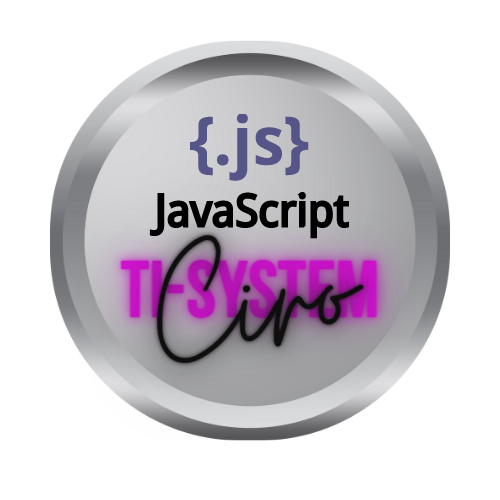

<h1 align="center"> 
Tradução de SQL com IA
</h1>

⚙️ Desenvolvimento de um app de tradução de SQL, capaz de receber um schema e responder com queries a perguntas feitas em linguagem natural através de inteligência artificial. ⚙️

 

  

 

## 🛠 Tecnologias

Esse projeto foi desenvolvido com as seguintes tecnologias:

- **[HTML](https://developer.mozilla.org/pt-BR/docs/Web/HTML)**
- **[CSS](https://developer.mozilla.org/pt-BR/docs/Web/CSS)**
- **[Javascript](https://developer.mozilla.org/pt-BR/docs/Web/JavaScript)**
- **[Figma](https://www.figma.com/dev-mode/)**
- **[NextJS](https://nextjs.org/docs/getting-started/installation)**
- **[Tailwind](https://tailwindcss.com/docs/installation)**
- **Pacote de Ícones [Lucide](https://phosphoricons.com/)**
- **Para pré-carregamento da fonte pelo servidor [next/font/google](https://nextjs.org/docs/pages/building-your-application/optimizing/fonts)**
- **Editor de código simples com sintaxe highlighting [react-simple-code-editor](https://github.com/react-simple-code-editor/react-simple-code-editor)**
- **[prismjs](https://prismjs.com/docs/index.html)**
- **[data-base-schema-examples](https://github.com/prisma/database-schema-examples/blob/main/postgres/basic-twitter/schema.sql)**

<em>
create table if not exists users (
  id uuid primary key not null default gen_random_uuid(),
  "name" text not null,
  handle text not null,
  created_at timestamp not null default now(),
  updated_at timestamp not null default now()
);

create trigger updated_at before update on users for each row execute procedure set_updated_at();

create table if not exists locations (
  id uuid primary key not null default gen_random_uuid(),
  latitude float not null,
  longitude float not null
);

create table if not exists tweets (
  id uuid primary key not null default gen_random_uuid(),
  created_at timestamp not null default now(),
  "text" text not null,
  "owner" uuid not null references users(id) on delete cascade,
  "location" uuid not null references locations(id) on delete cascade
);
</em>

- **[Vercel AI SDK](https://sdk.vercel.ai/docs/getting-started)**
- **[Chave OPEN IA](https://platform.openai.com/)**

 

## 🚀 Como Utilizar

- NextJS - Instalar e iniciar o NextJS:  
`pnpm create next-app [nome da aplicação]`

- Para rodar a aplicação:  
`pnpm dev`

Rota Padrão: `http://localhost:3000/`

- Instalar o lucide:  
`pnpm i lucide-react`

- Instalar o react-simple-code-editor:  
`pnpm i react-simple-code-editor`

- Instalar o prismjs e dependências:  
`pnpm i prismjs`   `pnpm i @types/prismjs -D`

- Instalar os pacotes Vercel AI SDK:  
`pnpm install ai openai`

- Crie uma conta e gere uma chave na plataforma da OPEN IA:  
`https://platform.openai.com/account/api-keys`

 

## 🎨 Layout

Você pode visualizar o layout  do projeto através [DESSE LINK](https://www.figma.com/community/file/1271110680628406853). É necessário ter conta no [Figma](https://figma.com) para acessá-lo.

 

## 📝 License

  

Esse projeto está sob a licença MIT.

 

### 👨‍💻 Autor

 
 <em>Ciro Batista da Silva<em>
 
  

 
👋🏽 Entre em contato!

 

